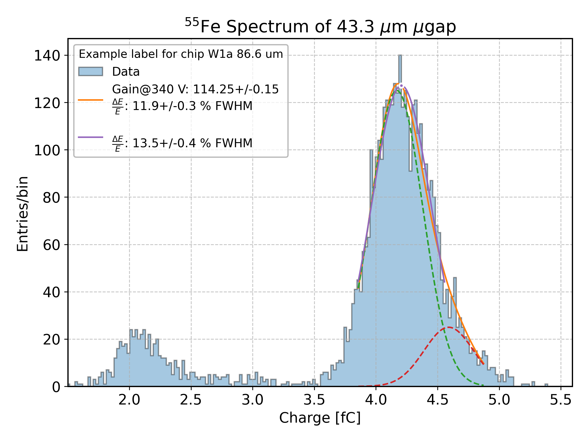
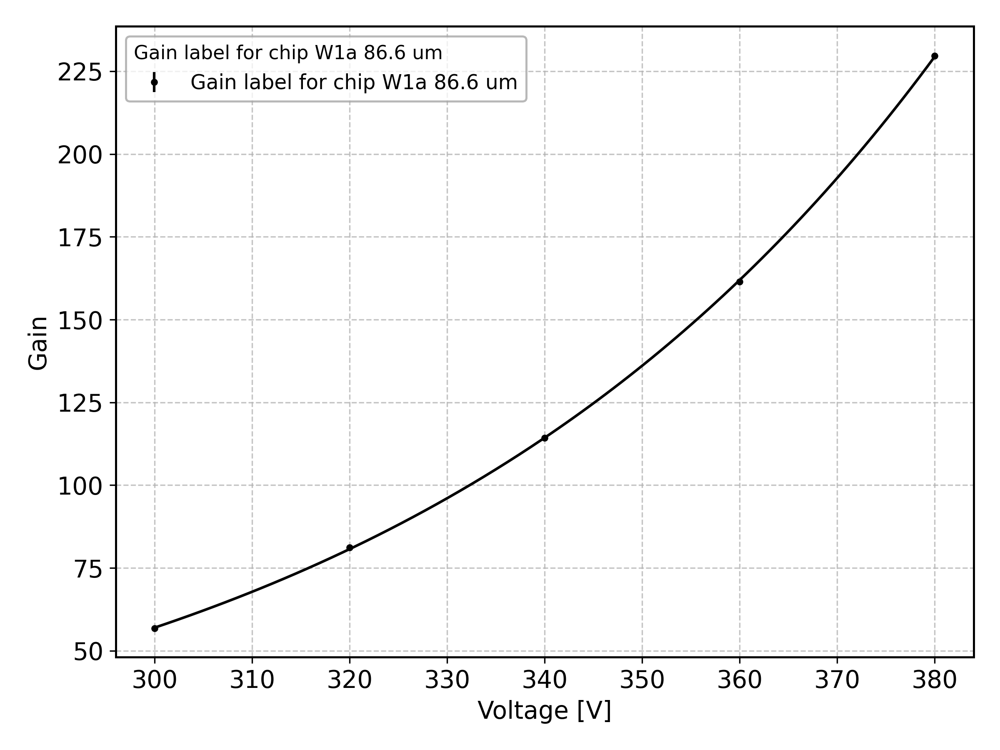
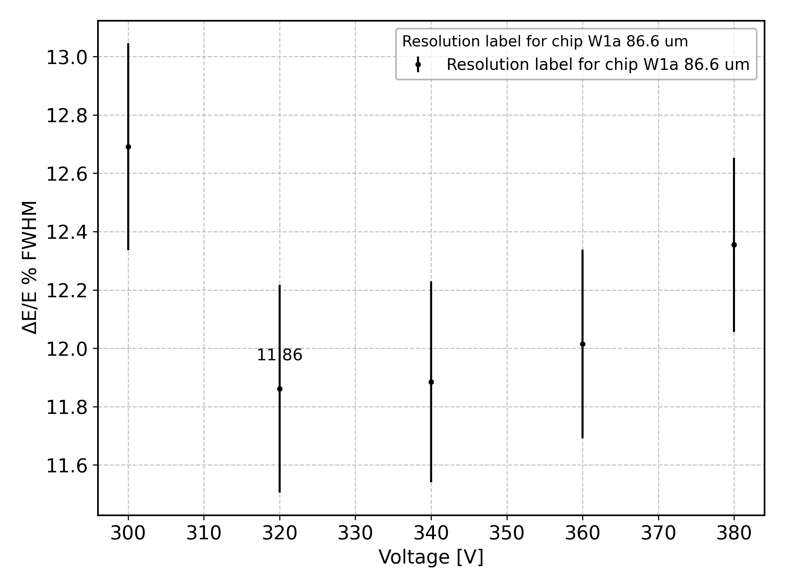
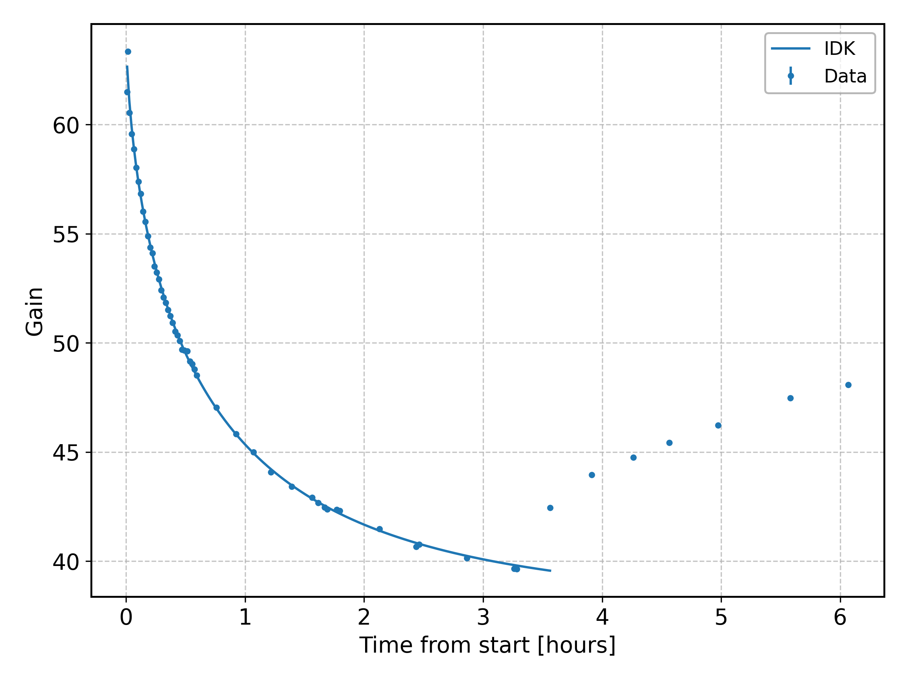
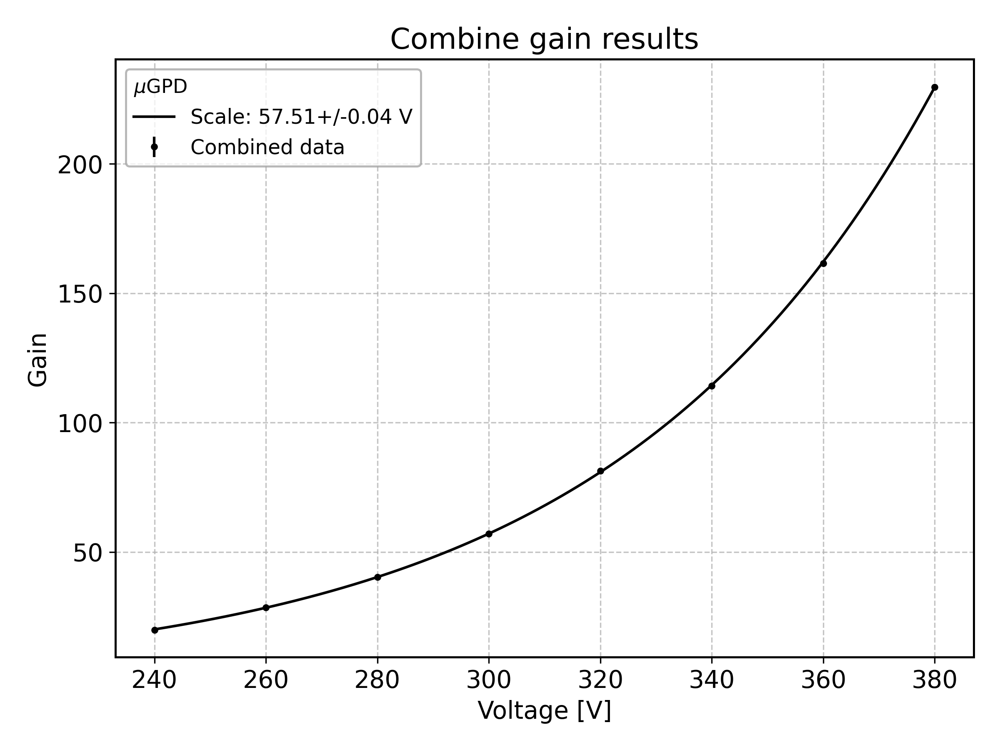
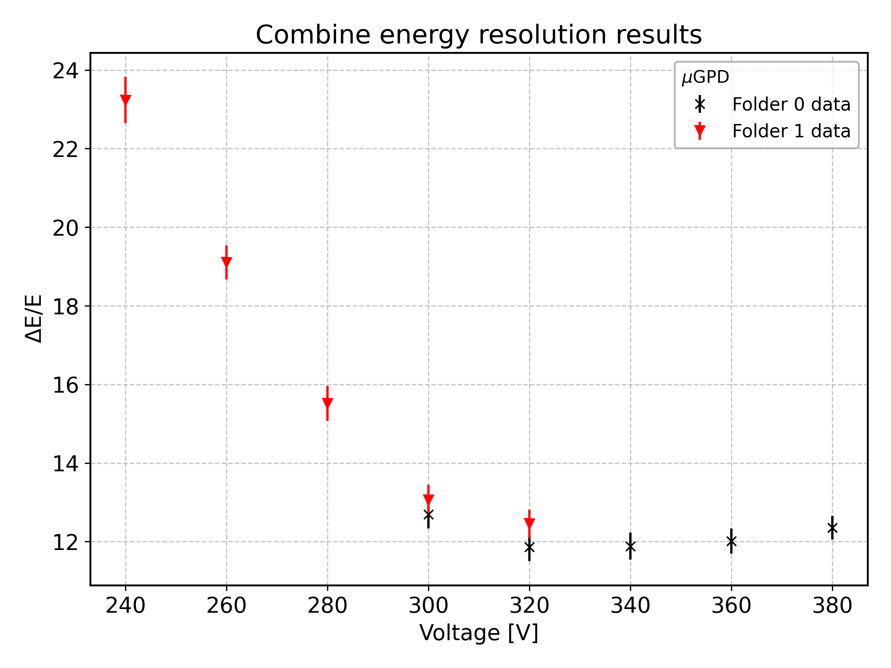

# **Examples of Analysis**

To run the analysis, first you need to write the configuration file following the [Analysis and Configuration Guide](guide.md).

## Single file analysis

In this example, a basic analysis of a single source file is performed. See the configuration YAML file snippet for more details.

```yaml
--8<-- "docs/examples/single_example_config.yaml"
```

After writing the configuration file, the analysis can be launched from the command line interface with:

```bash
analysis path_config path_source path_calibration
```

After the analysis is completed, the result is the following plot, showing the main emission line and the escape peak, along with the fit models and the legend showing the gain and energy resolution results:



## Folder analysis

In this example, the analysis of a folder is performed. You can see from the configuration YAML file snippet below that the configuration file doesn't differ much from that for the single file analysis. Indeed, the configuration files are quite flexible and most of the tasks can be executed both on single and multiple files or folders. The main difference for some tasks is the possibility to specify particular keys that work only on multiple files, otherwise nothing is done.

```yaml
--8<-- "docs/examples/folder_example_config.yaml"
```

The command to run is:
```bash
analysis path_config path_folder
```

Setting the `show` key to `true` for the `gain` and `resolution` tasks, the output plots are the following:




## Analysis of gain variation with time

In this example, the analysis of a folder to study the gain variation with time is performed. The gain is estimated during the task, so it is not necessary to execute a `gain` task before. The gain is fitted in a fixed range with a composite model `StrecthedExponential + Constant`.

```yaml
--8<-- "docs/examples/gain_trend_example_config.yaml"
```

The command to run is the same as the [Folder Analysis](#folder-analysis) example. The output of the program is the following:



## Gain and resolution comparison of two folders

In this example, two folders are analyzed to compare the gain and the energy resolution estimates. The gain data is combined together and fitted with a single exponential. The energy resolution is only compared. 

**Note:** to execute these tasks, it is necessary to first execute the `gain` or `resolution` tasks, and then

```yaml
--8<-- "docs/examples/folder_comparison_example_config.yaml"
```

To run this analysis the command is:

```bash
analysis path_config path_folder0 path_folder1
```

The output is the following:




